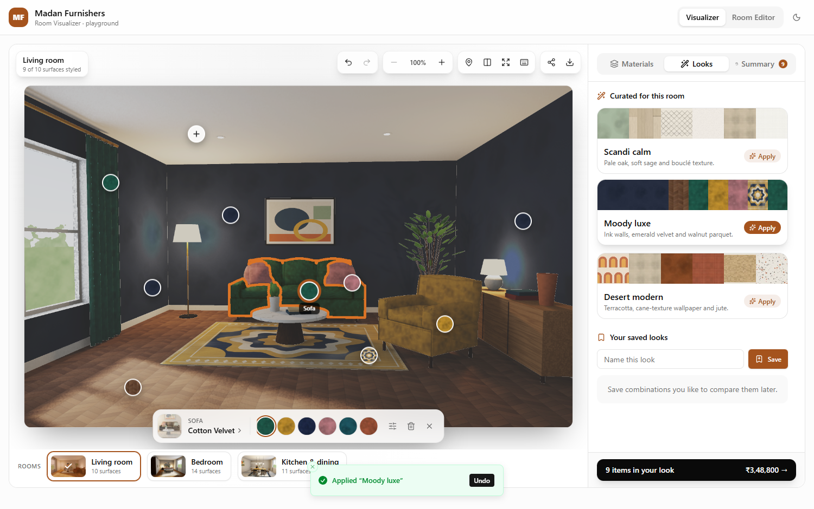
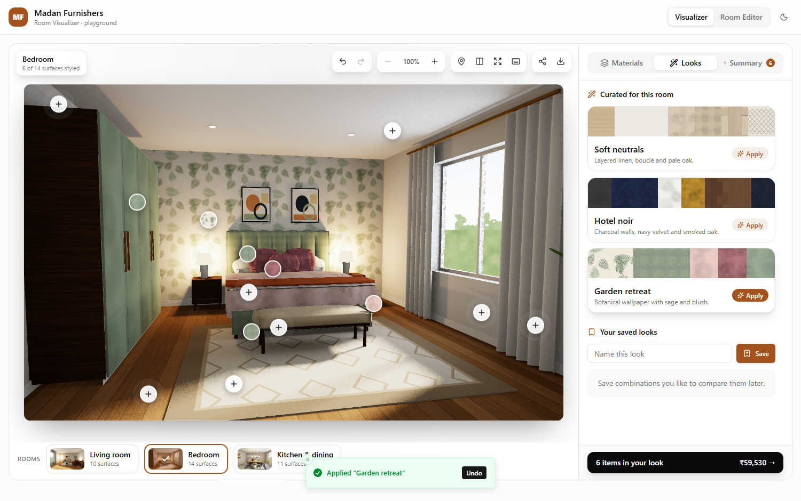
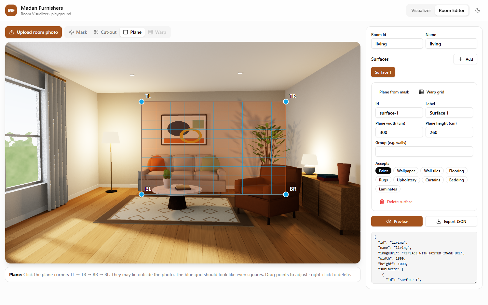

# @madan/room-visualizer

A drop-in **room visualizer** for the Madan Furnishers Vue 3 storefront. Shoppers pick a room, tap a wall, the floor or a piece of furniture, and see Madan's products and variants (paint, wallpaper, tiles, flooring, rugs, upholstery, curtains, bedding, laminates) applied in perspective with the room's real lighting. Then they can compare, save, share, and add the whole look to the cart.

Built with **Vue 3 + TypeScript + Tailwind + shadcn-vue (reka-ui)** and a small custom **WebGL2** renderer. It has no dependency on Materialo or any other hosted service.



## Features

**Shopper experience**
- Click a surface or its hotspot pin to style it. Hover labels show what's applied.
- A quick-swap bar on the stage changes colourways in one click, adjusts the pattern, or removes the material.
- Product browser filtered to what the surface accepts, with search, sort, category chips and recently used swatches.
- Product detail with colourway hover preview, specs, and a per-surface quantity and cost estimate.
- **Pattern controls:** scale, rotation, horizontal/vertical shift.
- **"Apply to all walls"** for grouped surfaces.
- **Curated looks** per room, plus **saved looks** (stored in the browser).
- **Before / after** comparison slider.
- Zoom and pan (Ctrl/⌘ + scroll, pinch, double-click), fullscreen, keyboard shortcuts.
- **Undo / redo** across every change.
- **Summary** with quantities (litres, rolls, m², metres, pieces) including wastage, line totals, and an "add all to cart" button.
- **Share link** (`?room=…&look=…`) that reproduces the exact look, including pattern adjustments.
- **Download** a high-res render or a **moodboard** (room + swatches + product list + total).
- Responsive layout, dark mode, toasts with undo.

**Rendering**
- **ID-map masks:** each surface is one colour in a surface map, so occlusion is exact (a lamp in front of a wall, cushions on a sofa). Edges are anti-aliased with 4-tap coverage.
- **Planar surfaces** use a perspective-correct homography. **Curved surfaces** (sofas, curtains, duvets) use warped meshes with per-patch depth ordering.
- **Exact relighting:** when a room ships a shading map, materials are lit as `tonemap(albedo × irradiance)`, so shadows, sun patches and lamp glow carry over. Plain photos fall back to luminance-ratio relighting.
- Real-world tiling from each variant's `tileSizeCm`, mipmaps plus anisotropic filtering, and crossfade transitions.

## Quick start

```bash
npm install
npm run dev
```

This opens the playground at http://localhost:5173. It contains the visualizer (mock catalog: 34 products, 119 variants, 3 rooms) and a **room editor**.

| Script | What it does |
| --- | --- |
| `npm run dev` | Playground with the mock catalog |
| `npm test` | Unit tests (homography, URL state, history, estimates, room data integrity) |
| `npm run typecheck` | `vue-tsc` |
| `npm run build` | Library build → `dist/` |
| `npm run scenes` | Re-render the mock rooms (multi-threaded path tracer, ~2 min/room) |
| `npm run scenes:preview` | Fast half-res render for iterating on scenes |
| `npm run catalog` | Regenerate the mock catalog JSON |
| `npm run shoot` | Headless screenshot pass of the playground (uses your local Chrome/Edge) |

## Using it in the Madan app

```bash
npm install github:<owner>/<repo>
```

**1. Tailwind.** The components use shadcn token classes, so they pick up the app's theme automatically. Add the preset and let Tailwind scan the package:

```ts
// tailwind.config.ts
import visualizerPreset from '@madan/room-visualizer/tailwind-preset'

export default {
  presets: [visualizerPreset],
  content: ['./src/**/*.{vue,ts}', './node_modules/@madan/room-visualizer/dist/**/*.js'],
}
```

The preset needs the standard shadcn CSS variables (`--background`, `--primary`, … plus `--popover`), which a shadcn-vue app already defines.

**2. Render it:**

```vue
<script setup lang="ts">
import { RoomVisualizer, HttpProductSource, type AppliedItem, type Product } from '@madan/room-visualizer'

const source = new HttpProductSource({ baseUrl: import.meta.env.VITE_VISUALIZER_API })

function addToCart(items: AppliedItem[]) {
  // Each item carries the surface, product, variant (SKU) and an estimate.units quantity.
  cart.addMany(items.map((i) => ({ sku: i.variant.sku, qty: i.estimate.units })))
}
function openProduct(p: Product) {
  router.push(`/products/${p.id}`)
}
</script>

<template>
  <div class="h-[calc(100vh-4rem)]">
    <RoomVisualizer :source="source" sync-url @add-to-cart="addToCart" @view-product="openProduct" />
  </div>
</template>
```

| Prop | Default | |
| --- | --- | --- |
| `source` | — | Any `ProductSource` |
| `initialRoomId` | first room | |
| `syncUrl` | `false` | Mirror `?room=&look=` in the address bar |
| `currency` | `'INR'` | |
| `brand` | `'Madan Furnishers'` | Shown on moodboards |
| `storageKey` | `'madan-visualizer'` | localStorage namespace; `false` disables |
| `toasts` | `true` | Set `false` if the app already mounts a `vue-sonner` `<Toaster>` |

Events: `addToCart(items)`, `viewProduct(product)`, `variantApplied({ surface, product, variant })`, `roomChange(roomId)`.

For lower-level use, the package also exports `RoomRenderer`, `useVisualizerState`, `useCatalog` and the homography helpers. The mock catalog lives in a separate entry, `@madan/room-visualizer/mock`, so it never lands in production bundles.

## The API Madan needs to expose

`HttpProductSource` expects these endpoints (shapes in [`src/types.ts`](src/types.ts)). Use its `mapProduct` / `mapRoom` options if the backend's shapes differ.

```
GET /categories                                          → Category[]
GET /products?category=a,b&search=&sort=&page=&pageSize= → { items: Product[], total, page, pageSize }
GET /products/:id                                        → Product
GET /rooms                                               → Room[]
GET /rooms/:id                                           → Room
```

What matters per variant for the visualizer:
- `textureUrl`: a **seamless tile** photo or scan of the material.
- `tileSizeCm`: the real size that tile covers.
- `finish`.
- `tiling: 'stretch'` for one-off designs such as rugs.

`Product.pricing` (`unit`, `coverageM2`, `wastage`) drives the quantity estimates.

## Adding real rooms

There are two routes:

1. **Photograph and author.** Open the playground's **Room editor** and upload a photo. For each surface:
   - **Mask:** trace the visible region(s) and add **cut-outs** for anything in front of it.
   - **Plane:** click the 4 perspective corners. A live grid shows the projection.
   - **Warp** (optional): bend a grid over curved upholstery.
   - Set the accepted categories and group, then **Export JSON**.

   Rooms built this way use polygon masks and photo-based relighting.
2. **Render.** For the highest fidelity, render rooms the way the mock rooms are made. [`scripts/scene`](scripts/scene) is a small multi-threaded path tracer (BVH, area/sun/lamp lights, AO, edge-aware denoising). It exports the photo, a 2× surface ID map, an exact **shading map**, the per-surface mesh/quad patches projected from 3D, anchors, areas and curated presets. Scenes are plain TypeScript; see [`rooms/living.ts`](scripts/scene/rooms/living.ts).

## Architecture

```
src/
  components/
    RoomVisualizer.vue   root: layout, context, shortcuts, toasts, exports
    stage/               WebGL stage (zoom/pan/compare), hotspots, quick bar, toolbar, room strip
    panel/               materials browser, product detail, pattern controls, looks, summary
    ui/                  shadcn-style primitives (button, tabs, slider, tooltip, popover…)
  composables/           useVisualizerState (selections, history, looks, URL), useCatalog
  render/                RoomRenderer (WebGL2), shaders, homography, procedural textures
  data/                  ProductSource interface, HttpProductSource, MockProductSource + mock JSON
  lib/                   estimates, share-URL codec, moodboard export
playground/              demo app + room editor
scripts/scene/           offline path tracer that generates the mock rooms
public/mock-rooms/       generated photos, shading maps, ID maps, thumbnails
```

## Screenshots

| Bedroom, "Garden retreat" look | Room editor |
| --- | --- |
|  |  |
